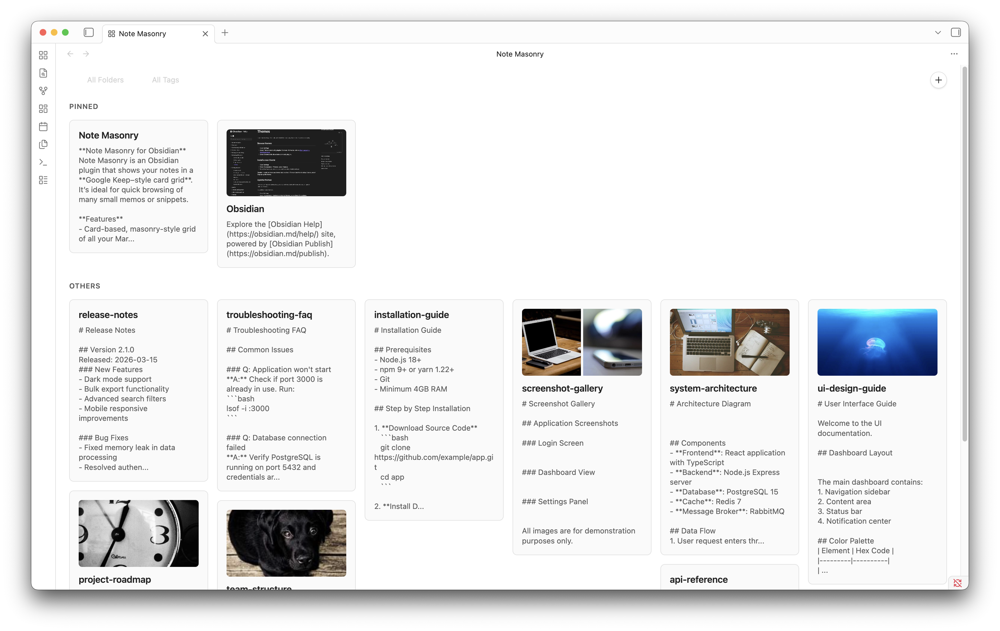
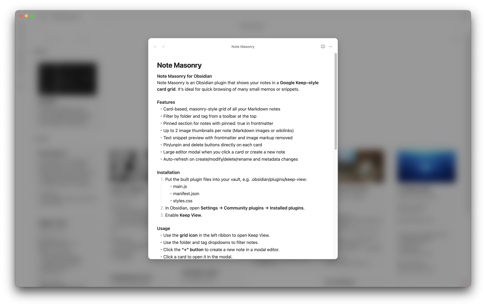

# Note Masonry for Obsidian
Note Masonry is an Obsidian plugin that shows your notes in a **Google Keep–style card grid**. It’s ideal for quick browsing of many small memos or snippets. It is not optimized for mobile use; it’s mainly intended for desktop.

## Features
- Card-based, masonry-style grid of all your Markdown notes
- Filter by folder and tag from a toolbar at the top
- Pinned section for notes with `pinned: true` in frontmatter
- Up to 2 image thumbnails per note (Markdown images or wikilinks)
- Text snippet preview with frontmatter and image markup removed
- Pin/unpin and delete buttons directly on each card
- Large editor modal when you click a card or create a new note
- Auto-refresh on create/modify/delete/rename and metadata changes
- Multiple Keep View tabs can be opened from the ribbon button

## Installation
1. Put the built plugin files into your vault, e.g. `.obsidian/plugins/note-masonry`:
	- `main.js`
	- `manifest.json`
	- `styles.css`
2. In Obsidian, open **Settings → Community plugins → Installed plugins**.
3. Enable **Note Masonry**.

## Usage
- Use the **grid icon** in the left ribbon to open Keep View.
- You can click the ribbon button multiple times to open multiple Keep View tabs/pages.
- Use the folder and tag dropdowns to filter notes.
- Click the **“+” button** to create a new note in a modal editor.
- Click a card to open it in the modal.
- Use the **pin icon** to toggle `pinned: true` in frontmatter.
- Use the **trash icon** to delete the note.

Note: The layout and interactions are designed for desktop; mobile usage is not optimized.