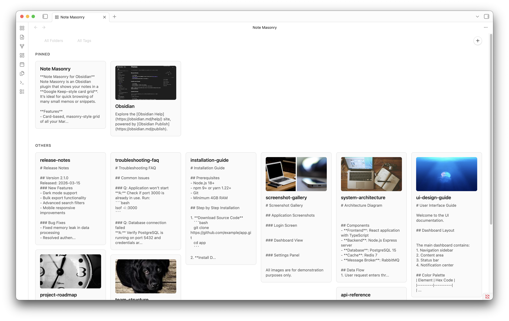
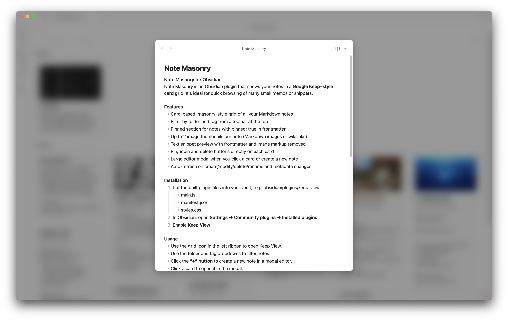

# Note Masonry for Obsidian
Note Masonry is an Obsidian plugin that shows your notes in a **Google Keep–style card grid**. It’s ideal for quick browsing of many small memos or snippets. It is not optimized for mobile use; it’s mainly intended for desktop.

## Features
- Card-based, masonry-style grid of all your Markdown notes
- Filter by folder and tag from a toolbar at the top
- Defaults to the `#WIP` tag filter when that tag exists in your vault
- Shuffle button to show 15 random notes (toggles on/off)
- Search bar to filter notes by title or content instantly
- Pinned section for notes with `pinned: true` in frontmatter
- Up to 2 image thumbnails per note (Markdown images or wikilinks)
- Text snippet preview with frontmatter and image markup removed
- Pin/unpin and split-view buttons directly on each card, plus a three-dot menu (Delete)
- Large editor modal when you click a card or create a new note, with your own hotkeys working inside (Esc to close)
- Drag a card onto a Canvas to add it as a file node
- Right-click a card for `Send to Canvas` / `Send to new Canvas` / `Delete`
- Auto-refresh on create/modify/delete/rename and metadata changes (debounced; deferred while an edit modal is open)
- Paginated rendering (100 at a time with infinite scroll) for large vaults
- Multiple Keep View tabs can be opened from the ribbon button

## Canvas Integration
- A grid icon button in the Canvas view header opens a **Canvas-filtered Card View** showing only that Canvas's file and text nodes, in placement order
- Filter banner (`Filtered by <canvas>`) with an `x` button to clear the filter; folder/tag/random/new-note controls are hidden and only the search bar remains in this mode
- Text nodes are shown as title-less cards and can be edited in the large modal via a single shared scratch file (written back to the Canvas node on close)
- `Cmd/Ctrl + click` a card to focus the corresponding node on the Canvas (cycles when the same file has multiple nodes)
- Plain left-click on a Canvas file-name label opens the linked file in a right split pane (existing pane is reused when possible). Toggleable in settings; `Cmd/Ctrl + click` keeps the default behavior
- Send-to-Canvas flow: uses the active Canvas if one is open, a picker when there are multiple Canvases, and auto-creates a Canvas when none exists

## Settings
- **Open canvas label in right split:** single-click a file name label on Canvas to open it in the right split pane (created if needed). Cmd/Ctrl+click behavior is unchanged
- **Default location for new files:** default folder for files created with the + button in Card View (vault-relative, empty means vault root). When a folder filter is active, that folder takes precedence. Missing folders are created automatically
- **Scratch folder for text editing:** Vault-relative folder for the shared `masonry-scratch.md` used to edit Canvas text cards (1 file shared by all Canvases, never auto-deleted). Scratch files are hidden from the grid, search, and random picks. To keep it out of search, adding it under `Settings → Files and links → Excluded files` is recommended

## Installation
1. Put the built plugin files into your vault, e.g. `.obsidian/plugins/note-masonry`:
	- `main.js`
	- `manifest.json`
	- `styles.css`
2. In Obsidian, open **Settings → Community plugins → Installed plugins**.
3. Enable **Note Masonry**.

## Usage
- Use the **grid icon** in the left ribbon to open Keep View.
- You can click the ribbon button multiple times to open multiple Keep View tabs/pages.
- Use the folder and tag dropdowns to filter notes (defaults to `#WIP` when present)
- Use the **shuffle button** to show 15 random notes; click again (or change filters/search) to exit
- Use the **search bar** at the top to filter notes by text in the title or body.
- Click the **“+” button** to create a new note in a modal editor (created in the active folder filter, or in the default location for new files when no folder filter is set).
- Click a card to open it in the modal (your hotkeys work there; `Esc` closes it).
- Drag a card onto an open Canvas to drop it as a file node.
- Right-click a card (or use the **three-dot menu**) for `Send to Canvas` / `Send to new Canvas` / `Delete`.
- Use the **pin icon** to toggle `pinned: true` in frontmatter.
- Use the **split pane icon** on a card to open the note in a right split view
- From an open Canvas, click the **grid icon** in the view header to open a Card View filtered to that Canvas; `Cmd/Ctrl + click` a card there to jump back to the node.

## Known Limitations
- **Mobile Support:** The layout and interactions are designed for desktop; mobile usage is not optimized.